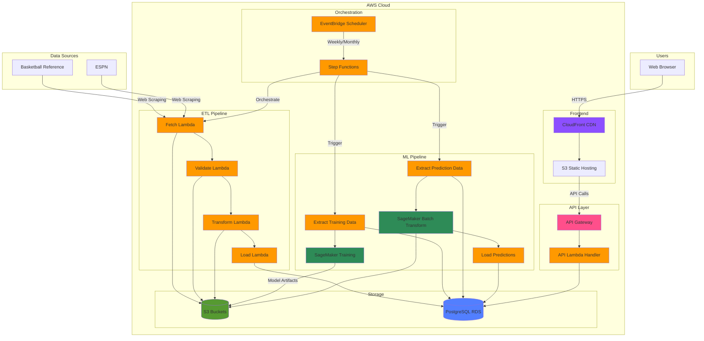

# Dunkonomics - NBA Salary Cap Optimizer
[](https://www.python.org/downloads/)

## Overview

An end-to-end MLOps platform that uses machine learning to predict Fair Market Value (FMV) for NBA players. The system analyzes player performance data (statistics, age, position, historical trends) to predict what each player's salary should be worth, then compares these predictions to actual contracts to identify undervalued and overvalued players across the league.

## Technology Stack

### ML Pipeline
Python-based training and inference using Random Forest models on AWS SageMaker. Automated feature engineering with 60+ features, hyperparameter tuning, and batch transform jobs for predictions.

### MLOps Infrastructure
Fully automated with AWS Step Functions orchestrating ETL, training, and prediction pipelines. EventBridge schedules for weekly stats updates and model retraining. Model versioning and metadata tracking for reproducibility.

### Data Engineering
Serverless ETL with AWS Lambda extracting from Basketball Reference (player stats) and ESPN (salary data), transforming data, and loading to PostgreSQL (RDS). S3 for model artifacts and intermediate data storage.

### Infrastructure as Code
Terraform managing all AWS resources (Lambda, SageMaker, RDS, VPC, API Gateway, IAM, Route 53, CloudFront, Certificate Manager). GitHub Actions CI/CD for automated deployments with approval gates. Modular architecture with separate environments for dev/prod.

### Security & Monitoring
VPC with private subnets for Lambda and RDS isolation. Secrets Manager for database credentials. CloudWatch for logging and monitoring. IAM roles with least privilege access. EC2 Bastion host for secure database access.

### Frontend & Deployment
Next.js 14 with TypeScript and Tailwind CSS hosted on S3/CloudFront for global content delivery.

## Architecture



## ML Model Details

### Problem Formulation
Two separate regression models predict different salary targets:
1. Actual Salary Model: Predicts `log_salary_cap_pct` (salary as % of salary cap) - reflects CBA constraints
2. Fair Market Value Model: Predicts `log_salary_pct_of_max` (salary as % of personal max) - reflects true player value

Contract inefficiencies are identified by comparing these two predictions.

### Model Architecture
- **Algorithm**: Random Forest Regressor (scikit-learn)
- **Hyperparameters**:
  - n_estimators: 200
  - max_depth: 20
  - min_samples_split: 5
  - min_samples_leaf: 2
  - max_features: sqrt

### Feature Engineering (60 Features)

**Volume Stats (13 features)**
- Raw: games_played, games_started, fouls
- Log transforms: log_points, log_rebounds, log_assists, log_turnovers, log_minutes, log_fg3a
- Sqrt transforms: sqrt_blocks, sqrt_steals
- Signed log: vorp_signedlog, ws_signedlog

**Efficiency Stats (12 features)**
- per, ts_pct, efg_pct, usg_pct, fg_pct, fg2_pct, fg3_pct, ft_pct, bpm, obpm, dbpm, ws_per_48

**Percentage Stats (7 features)**
- orb_pct, drb_pct, trb_pct, ast_pct, stl_pct, blk_pct, tov_pct

**Advanced Stats (2 features)**
- ows_signedlog, dws_signedlog

**Experience Tier (3 features - one-hot encoded)**
- exp_tier_0-6_years (rookie scale: 25% of cap max)
- exp_tier_7-9_years (early free agency: 30% of cap max)
- exp_tier_10+_years (veteran max: 35% of cap max)

**Position (5 features - one-hot encoded)**
- pos_PG, pos_SG, pos_SF, pos_PF, pos_C

**Position Interaction Features (18 features)**
- PG: fg3a, ts_pct, ast_pct, obpm
- SG: fg_pct, ts_pct, efg_pct, tov_pct
- SF: age, steals, dws
- PF: blocks, orb_pct, rebounds
- C: dbpm, ast_pct, blocks, steals

### Model Performance
- RMSE: Root Mean Squared Error on log-transformed salary
- MAE: Mean Absolute Error on log-transformed salary
- R² Score: Coefficient of determination
- Within ±20% accuracy: Percentage of predictions within 20% of actual salary
- Bias correction: Adjusts predictions when converting from log scale back to dollar amounts

### Training Approach
- Multi-season historical data (2015-2024)
- Train/validation split with temporal awareness
- Cross-validation for hyperparameter tuning
- Automated retraining pipeline (monthly via EventBridge)

## Getting Started

### Prerequisites
- Python 3.11
- Node.js 18+ (for frontend)
- AWS CLI configured
- Terraform 1.0+
- PostgreSQL client (optional, for local DB access)

### Local Setup

1. **Clone the repository**
```bash
git clone https://github.com/arnavnair220/nba-cap-optimizer.git
cd nba-cap-optimizer
```

2. **Create Python virtual environment**
```bash
python -m venv .venv
.venv\Scripts\Activate.ps1  # Windows PowerShell
# OR
source .venv/bin/activate    # Linux/Mac
```

3. **Install dependencies**
```bash
pip install -r requirements.txt
pip install -r requirements-dev.txt
```

## CI/CD Pipeline

### GitHub Actions Workflows

**Development Pipeline** (`dev-deploy.yaml`)
- Triggered on push to `develop` branch
- Automated deployment to dev environment

**Production Pipeline** (`prod-deploy.yaml`)
- Triggered on push to `main` branch
- Manual approval gate before deployment

### Pipeline Stages

1. Lint & Format - Code formatting, linting, and type checking
2. Run Tests - Unit and integration tests
3. Security Scan - Dependency vulnerabilities and secret scanning
4. Build Packages - Lambda functions and layers
5. Deploy Infrastructure - Terraform plan/apply with approval gates
6. Deploy Frontend - Next.js build and CloudFront deployment
